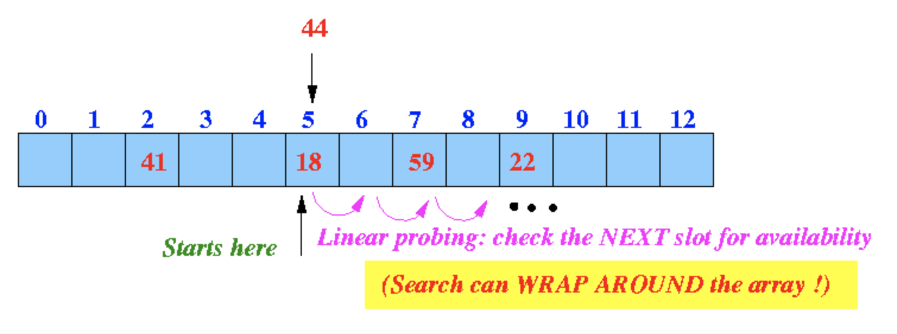
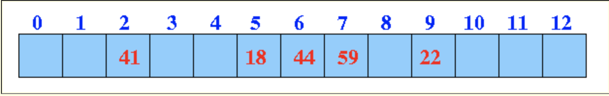

# Hash Table (해쉬 테이블)
https://en.wikipedia.org/wiki/Hash_table

+ [Basics](#basics)
+ [Real Life Use Case](#reallifeusecase)
+ [Implementation](#implementation)
+ [Time Complexity](#timecomplexity)

<h2 id='basics'>HashTable Basics</h2>

아파트의 편지함을 떠올려 보자. 각 세대마다 하나의 편지함이 있다.   
우편배달원은 우편에 적힌 세대번호를 확인하고 알맞는 편지함에 넣는다.  

이렇게 함으로써 각각의 세대가 자신에게 온 우편만 확인할 수 있다.  
606호는 606호 편지함을 확인하면 되고, 1301호는 1301호 편지함을 확인하면 된다.  

만약 편지함이 각각의 세대마다 있지 않고 하나의 편지함만 있다면 각 세대에 온 편지를 찾는데 불필요하게 시간이 낭비될 수 있다.  

해쉬 테이블도 이와 같은 개념이다. 각각의 자료마다 주소를 만들어주고, 각각의 주소에 해당하는 공간이 한정적으로 존재하고, 자료에 있는 주소지를 확인하여 해당 하는 공간에 보관하는 것이다.  

해쉬테이블 자료구조를 사용하면, 자료를 보관할 때 찾기 쉽도록 정리하기 때문에 어디서 찾아야할지 알고 그만큼 자료를 찾는 시간도 단축된다. 

---

일단 해쉬 테이블 자료구조를 더 살펴보기 전에 해쉬 함수에 대해 알아보자.  

해쉬 함수는, 자료를 인자로 받아 해당 자료가 들어갈 **주소**를 만들어낸다.

위의 그림을 보면 banana는 해쉬함수에 들어간 후에 오른쪽 공간의 1번칸에 들어있다.  

banana가 해쉬함수를 거치면 **항상 동일한 주소**를 생성할 것이다.

여기서 중요한 부분은 해쉬 함수는 완전히 무작위로 숫자를 생성한다기보다는 한정된 공간의 수 안에서 주소를 뽑아낸다는 것이다.  

> 10개의 공간에 10개의 자료를 해쉬함수를 거쳐 보관 하면 어떻게 될까?

해쉬함수는 빈자리에 차곡차곡 채워넣는 주소를 만들어 낸다기보다는 특정한 논리를 따라 주소를 만들어 낸다.  

그러니까 동일한 주소가 여러번 반복해서 나올 수도 있다는 말이다.

두가지의 다른 자료가 하나의 공간의 주소를 가진다면 그건 한 세대의 편지함에 다른 두세대의 편지가 들어가 있는 셈이다.  

이런 상황을 **충돌 (collision)** 이라고 한다.

> 충돌이 일어나면 어떻게 할까?

잘 알려져 있는 두가지 해결방법을 알아보자:  

### (1) linear probing  

collision이 일어나면 빈자리가 있을 때까지 확인하고, 빈자리를 찾았다면 그 자리에 넣는 것이다.

위의 그림을 보면, 5번 자리에 18 이 먼저 들어가 있고, 44도 같은 주소로 나와서 넣으려고 하지만 충돌이 발생한다.  

그러므로 다음 칸을 확인하여 빈자리인지 알아본다. 만약 빈자리이면 그 자리에 44를 넣어주면 된다.  

위 그림에서 5번칸 다음인 6번 칸에 빈자리가 있으므로 44는 6번칸에 들어가게 된다. 

이것을 linear probing 이라고 한다. 

linear probing을 하다 만약 빈자리가 없다고 판단되거나, 공간 안에 자리가 넉넉하지 않을 경우에는 공간들을 늘려주면 된다.  

마치 더 많은 세대들을 위한 편지함을 더 생성한다고 생각해 볼 수 있다. 

### (2) separate chaining 

다음은 separate chaining이라는 방법인데, 서로 다른 자료에 동일한 주소지가 배정되었을 경우 자료들을 list 형식으로 같은 공간에 보관하는 방법이다.  
 
5층 빌라에 각 층을 위한 편지함이 하나씩 있다고 생각해볼 수 있다.

1층을 위한 편지함에는 편지 1통이 들어있고, 2층을 위한 편지함엔 2통의 편지, 3층 세대 편지함엔 2통의 편지, 그리고 4층 세대 편지함엔 3통의 편지가 들어있는 셈이다.  

이 방법은 linear probing과 다르게 공간을 늘리거나 줄이거나 할 필요가 없다.

하지만 원하는 편지를 찾는데에는 다소 시간이 걸리듯 시간 복잡도가 약간 더 늘어난다. 

시간복잡도 (time complexity)에 대해서는 하단에 있는 해당 주제에 관한 섹션에서 더 얘기할 것이다.

<h2 id='reallifeusecase'>Real Life Use Case</h2>

+ 주소록 --> 이정도는 알고 있어야하고 면접관들이 만족해하지 않는 예
+ 블록체인 --> 각 블록마다 고유의 해쉬가 만들어지고, 각 블록마다 이전의 블록의 해쉬를 가리킨다. 이런 방식으로 해쉬를 사용하면 해킹을 막을 수 있다. -> 블록의 내용이 바뀌면 해쉬넘버도 바뀌고, 해쉬 넘버가 바뀌면 그 다음 블록이 그 전의 블록을 찾을 수 없고, 여기서 보안의 문제가 생긴걸 알아차릴 수 있음.
+ 자바스크립트 실행 엔진 소프트웨어 --> 
  + 크롬이라는 브라우저에는 V8이라는 엔진이 사용되는데 소스코드는 C++로 되어있고
  + 그 소스코드엔 객체를 해쉬테이블로 구현할 것을 찾을 수 있고 다른엔진들도 많이 사용함.
  + 자바스크립트는 고차원 언어이고 메모리 관리하는 언어가 아니기 떄문에 자바스크립트 자체로 해쉬테이블 구현해서 쓰는 경우는 거의 없을 것임.
  + 자바스크립트 객체들은 밑단에서 보면 해쉬 테이블로 구현이 되어있음

<h2 id='implementation'>Hash Table Implementation</h2>

해쉬 테이블을 만들기 위해선 우선 편지가 들어갈 편지함, 즉 한정된 숫자의 자료가 담길 수 있는 공간을 만들어야 하는데, LimitedArray라는 한정된 배열를 반환하는 함수를 만들어야한다. 이 함수는 공간의 숫자를 인자로 받고, 그에 따른 크기의 배열을 반환해야한다.  

~~~javascript
var LimitedArray = function(limit) {
  var storage = [];

  var limitedArray = {};

  limitedArray.get = function(index) {
    checkLimit(index);
    return storage[index];
  };

  limitedArray.set = function(index, value) {
    checkLimit(index);
    storage[index] = value;
  };

  return limitedArray;
};
~~~

 그리고 이 LimitedArray에는 편지를 넣거나 빼거나 혹은 찾아볼수 있는 method들이 필요하다. 이 LimitedArray에는 특정 위치에 자료를 가져올 수 있는 get과 특정위치에 자료를 만들 수 있는 set이 있다.

~~~javascript
var HashTable = function() {
  this._limit = 8;
  this._storage = LimitedArray(this._limit);
  this._count = 0;
};

var hashTable = new HashTable ();
~~~

이렇게 하면 hashTable이라는 빈 객체에 `._limit : 8`, `._storage : LimitedArray`, 그리고 `._count`라는 key value pair이 생기게 된다.  

편지함이 만들어졌는데, 아직 주소지를 붙일 해쉬함수는 없다.  
해쉬함수를 구현하는 것은 포스팅이 매우 길어질 수 있기 때문에 따로 찾아보는 편을 추천한다.  

아래는 과제에서 썼던 해쉬함수이다. 이 해쉬함수가 어떻게 해쉬번호를 출력해내는지에 대해는 알아보진 않았다.

다만, 첫인자인 k와 두번째인자인 this._limit으로 전체공간의 숫자에 국한해서 string을 받아 해쉬번호를 생성한다.
~~~javascript
var index = getIndexBelowMaxForKey(k, this._limit);
~~~

이런식으로 어느 세대의 편지함에 들어갈지 주소가 정해지는 것과 같다보면 된다.  

이제 편지함에 들어갈 편지를 만드는 작업과 편지함에 어떤 편지가 들어가 있는지 확인하는 작업, 그리고 편지함에 들어간 편지를 빼내는 작업이 남았다.

사실 이 부분이 가장 중요하지만 일단은 나중에 다시와서 포스팅을 마쳐야겠다...

<h2 id='timecomplexity'>Time Complexity</h2>

