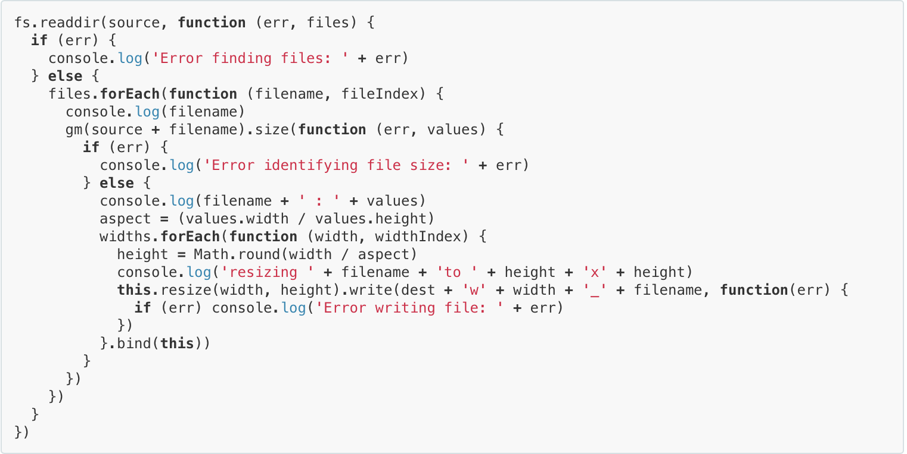

### What is a callback function?

Speaking in terms of asynchronous programming in Javascript, a callback function is the function that is invoked in an async operation when its tasks are finished to either signal that error was found, or continue tasks in async operations.

Let's say that a function invokes another function when all of its tasks have been completed, or when there was an error.

That function that is being invoked is callback function! 

Simple. Isn't it?

Here's another definition of callback from [codeburst](https://codeburst.io/javascript-what-the-heck-is-a-callback-aba4da2deced) if needed:

**Simply put**: A callback is a function that is to be executed after another function has finished executing — hence the name ‘call back’.  

**More complexly put**: In JavaScript, functions are objects. Because of this, functions can take functions as arguments, and can be returned by other functions. Functions that do this are called higher-order functions. Any function that is passed as an argument is called a callback function.

That's enough words. Look at an example below to check and see callback function for yourself!

```js
downloadVideo('www.youtube.com/12345678', handleVideo)

function handleVideo (err, video) {
  if (err) {
    console.log('download error');
  } else {
    console.log('download finished');
  }
}

console.log('download started');
```

Download video is an async function that takes string url as its first argument and **a callback function as its second argument**, `handleVideo`.

`function handleVideo` will be called after the async `function downloadVideo` has finished its job asynchronously

The callback function `handleVideo` simply logs whether download has finished or there was an error. However, callback functions doesnt have to be regular function. They can also be asynchronous function that calls on another callback function on its completion.

The nesting of async functions, which includes an async callback function looks like this:



This is an example from [callbackhell.com](www.callbackhell.com).  

The chaining of callbacks make it difficult to understand the code, and is very mistake-prone, creating a *callback-hell.*

Just remember, callback function is the function that is called on in async operation to either signal that error was found, or continue tasks in async operations.


